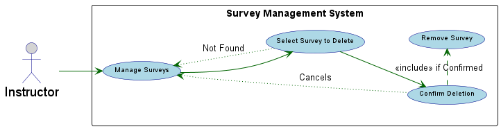

Sub-Use Case: Delete survey.
=================================
**Actors**: Instructor

**Scope**: Software system

**Purpose**: The purpose of this use case is to provide Instructors with the functionality to remove surveys they no longer need, helping them manage their course content effectively and keep their survey lists clean.

**Type**: Primary Actor: Instructor

**Overview**: This use case describes how an Instructor can delete an existing survey from the system. This action is irreversible and permanently removes the survey and its associated data.

| Actor Action | System Response |
|:--------------|:----------------|
| 1. The Instructor navigates to the survey management section. | 2. The system displays the list of existing surveys. |
| 3. The Instructor selects a survey to delete and chooses the "Delete" option. | 4. The system prompts for confirmation. |
| 5. The Instructor confirms the deletion. |  6. The system removes the survey. | 

Alternative Courses:
-----------

At Step 5 (Instructor confirms the deletion) of the Typical Course of Events:
**1**The Instructor chooses to cancel the deletion instead of confirming. <br> $\rightarrow$
The system dismisses the confirmation prompt and returns the Instructor to the survey management section with the survey still present.  

At Step 3 (Instructor selects a survey to delete) of the Typical Course of Events:
**2** The selected survey is no longer available (e.g., it was deleted by another administrator simultaneously).  <br> $\rightarrow$
The system displays an error message indicating that the survey could not be found or has already been deleted.  <br> $\rightarrow$
The system refreshes the list of surveys.

Preconditions : 
-----------
$\rightarrow$ The Instructor must be logged into the system. <br>
$\rightarrow$ The Instructor must have appropriate permissions to manage and delete surveys. <br>
$\rightarrow$ At least one survey must exist in the system.

Postconditions
-----------
$\rightarrow$ Successful Deletion: The selected survey is permanently removed from the system. <br>
$\rightarrow$ Cancelled Deletion: The selected survey remains in the system, and no changes are made. <br>
$\rightarrow$ Survey Not Found: The selected survey remains in the system (or was already removed), and the Instructor is notified of the issue.

```markdown
@startuml
left to right direction

skinparam usecase {
    BackgroundColor lightblue
    BorderColor darkblue
    ArrowColor darkgreen
    FontName Arial
    FontSize 10
    StereotypeFontColor darkblue
}
skinparam actor{
    BorderColor darkblue
    BackgroundColor lightgray
    FontName Arial
    FontSize 19
}

actor Instructor as "Instructor"

rectangle "Survey Management System" {
  usecase (Manage Surveys) as UC_ManageSurveys
  usecase (Select Survey to Delete) as UC_SelectSurvey
  usecase (Confirm Deletion) as UC_ConfirmDelete
  usecase (Remove Survey) as UC_RemoveSurvey
}

Instructor --> UC_ManageSurveys
UC_ManageSurveys --> UC_SelectSurvey
UC_SelectSurvey --> UC_ConfirmDelete
UC_ConfirmDelete .> UC_RemoveSurvey : <<include>> if Confirmed

UC_ConfirmDelete -[dotted]left-> UC_ManageSurveys : Cancels
UC_SelectSurvey -[dotted]up-> UC_ManageSurveys : Not Found

@enduml
```
