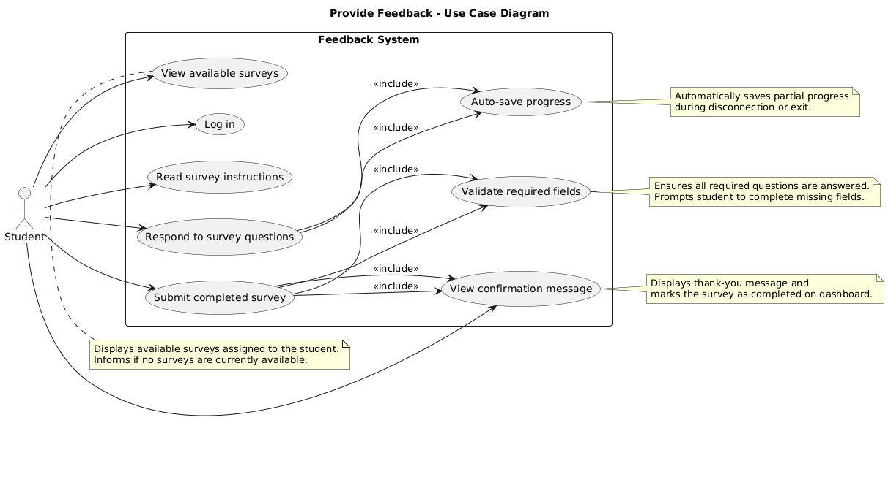

Use Case: Provide Feedback
=================================
**Actors**: Student

**Scope**: Software system

**Purpose**: Allow students to complete and submit their responses to surveys.

**Type**: Primary

**Preconditions**:
- The student is logged into the system.
- At least one survey is available for the student to complete.

**Postconditions**:
- The feedback is successfully submitted and securely stored in the system.
- A confirmation message appears on the student’s dashboard.
- The instructor or authorized personnel can later access and review aggregated student responses for analysis.

**Overview**:  
Students log in to the system and access their personalized dashboard, where they can view a list of available surveys assigned to them. They select a survey, read the instructions, and respond to each question, which may include multiple-choice, rating scales, or open-ended responses. Students can review and edit their answers before submitting. Upon submission, the system securely stores the feedback for future analysis and may provide a confirmation message. If a student leaves a survey incomplete, their progress is saved for later completion. The system supports saving partial progress automatically, ensuring that responses are not lost in case of disconnection or unexpected exit.

Typical Course of Events:
----------------------

| Actor Action | System Response |
|:--------------|:----------------|
| 1. The Student logs in and accesses their dashboard. | 2. The system authenticates the Student and displays the dashboard with available surveys. |
| 3. The Student reviews the list and selects a survey to complete. | 4. The system displays the selected survey, including instructions and questions. |
| 5. The Student responds to each question, navigating through the survey. | 6. The system records each response as it is entered, allows navigation between questions, and saves partial progress automatically in case of disconnection or exit. |
| 7. The Student reviews their answers and submits the completed survey. | 8. The system validates that all required fields are filled, confirms submission, securely stores the feedback for future analysis, and displays a confirmation message on the dashboard. |

Alternative Courses:
-----------
1a. No surveys are available:  
&nbsp;&nbsp;&nbsp;&nbsp;1. The system informs the Student that no surveys are currently available and provides an option to refresh or return later.

5a. The Student exits the survey before completion:  
&nbsp;&nbsp;&nbsp;&nbsp;1. The system automatically saves the Student's progress, allowing them to resume later from where they left off. Upon next login, the student is notified of any incomplete surveys.

7a. Required questions are not answered:  
&nbsp;&nbsp;&nbsp;&nbsp;1. The system highlights unanswered required fields and prompts the Student to complete all required fields before allowing submission.

Section: Submitting Feedback
-----------
| Actor Action | System Response |
|:--------------|:----------------|
| 1. The Student completes all questions in the survey. | 2. The system checks that all required fields are filled and highlights any missing responses. |
| 3. The Student submits the survey. | 4. The system confirms successful submission, stores the data securely, displays a thank-you message or feedback summary, and updates the dashboard to reflect the completed survey. |

Security and Privacy Considerations:
-----------
- All feedback is stored securely and access is restricted to authorized personnel.
- Student responses are anonymized or pseudonymized where appropriate to protect privacy.
- The system complies with relevant data protection regulations (e.g., GDPR, FERPA).
- Only aggregated or anonymized data is accessible to instructors or administrators for analysis.

Here is the link overview of the plantUML:

